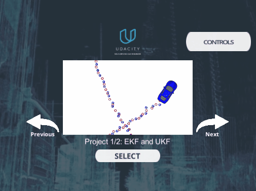

# self-driving
----

[English Description](README_EN.md) 

> 这个项目主要是为了记录和展示自己在无人车方面的收获和未来的计划。

## TODO
- [ ] VIO
- [ ] 3D_Object_Tracking
- [ ] Unscented_Kalman_Filter

## Work Done

### 1.  [车道线检测](https://github.com/suljaxm/CarND-Advanced-Lane-Lines)

### 2.  [车辆行为预测](https://github.com/suljaxm/CarND-Behavioral-Cloning)

 

### 3. [扩展卡尔曼滤波](https://github.com/suljaxm/CarND-Extended-Kalman-Filter-Project)

 

### 4. [粒子滤波定位](https://github.com/suljaxm/CarND-Kidnapped-Vehicle-Project)

 

### 5. [高速路轨迹规划](https://github.com/suljaxm/CarND-Path-Planning-Project)

 

### 6. [PID控制器](https://github.com/suljaxm/CarND-PID-Control-Project)

 

