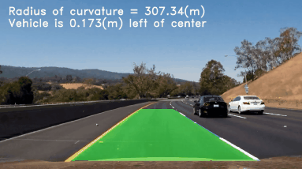
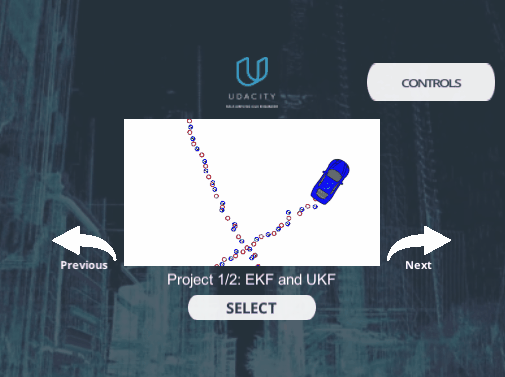
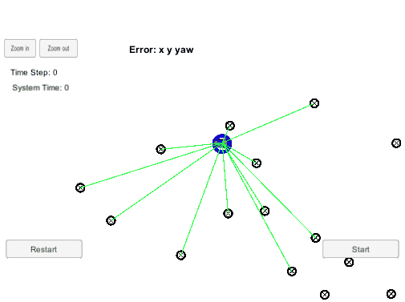

# self-driving
----

> In this project I will record and show my achievements and future plans in the field of Self-Driving.

## TODO
- [ ] VIO
- [ ] 3D_Object_Tracking
- [ ] Unscented_Kalman_Filter

## Work Done

### 1.  [Advanced-Lane-Lines](https://github.com/suljaxm/CarND-Advanced-Lane-Lines)

### 2.  [Behavioral-Cloning](https://github.com/suljaxm/CarND-Behavioral-Cloning)

 

### 3. [Extended-Kalman-Filter-Project](https://github.com/suljaxm/CarND-Extended-Kalman-Filter-Project)

 

### 4. [Kidnapped-Vehicle-Project](https://github.com/suljaxm/CarND-Kidnapped-Vehicle-Project)

 

### 5. [Path-Planning-Project](https://github.com/suljaxm/CarND-Path-Planning-Project)

 

### 6. [PID-Control-Project](https://github.com/suljaxm/CarND-PID-Control-Project)

 

